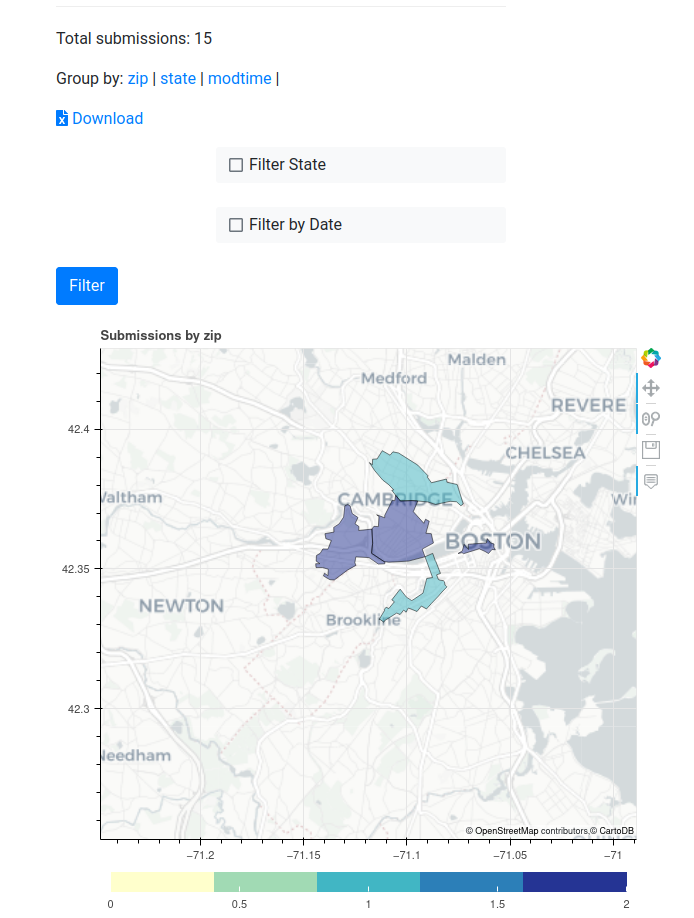

# docassemble.InterviewStats

A docassemble interview that lets you view statistics from other saved interview responses. 

## Getting Started

1. Pull this package into your [docassemble playground](https://docassemble.org/docs/playground.html), or install it on your [docassemble server](https://docassemble.org/docs/packages.html).
1. To generate data that this interview can consume, use the [store_variables_snapshot()](https://docassemble.org/docs/functions.html#store_variables_snapshot) function in your interview, i.e.  `store_variables_snapshot(data={'zip': users[0].address.zip})`.
1. Once you have reached the `store_variables_snapshot` point in your target interview, start the stats interview.
  1. If you're in the playground, run the `stats.yml` interview.
  1. If you installed the package, go to the `/start/InterviewStats/stats/` URL to start the interview.
1. Select the target interview in the drop down. 
1. You can export the data in a Excel format by clicking the `Download` link on the stats page.

## Example

## Roadmap

Currently, we can show simple grouping over all the data points in the interview stats. However, the
special visualization are only shown on based on the `zip` attribute. We're working to expand the
features available here in conjunction with our [EFiling Integration](https://github.com/SuffolkLITLab/EfileProxyServer).

If you have specific feature requests, feel free to open an issue or make a PR!

## Authors

* Quinten Steenhuis
* Bryce Willey

